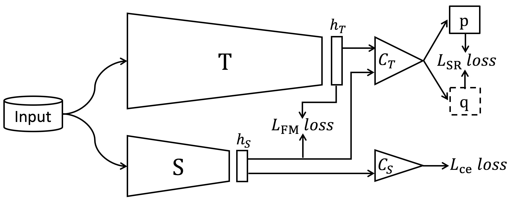

# SRRL
## Paper
[Knowledge distillation via softmax regression representation learning](https://openreview.net/pdf?id=ZzwDy_wiWv)

Jing Yang, Brais Martinez, Adrian Bulat, Georgios Tzimiropoulos

## Method
<div align="center">
     
</div> 

## Requirements
- Python >= 3.6
- PyTorch >= 1.0.1

## ImageNet Training
```python train_imagenet_distillation.py --net_s resnet18S --net_t resnet34T ```

```python train_imagenet_distillation.py --net_s MobileNet --net_t resnet50T ```

## Citation
```
@inproceedings{yang2021knowledge, 
  title={Knowledge distillation via softmax regression representation learning},
  author={Jing Yang, Brais Martinez, Adrian Bulat, Georgios Tzimiropoulos},
  booktitle={ICLR2021},
  year={2021}  
}
```

```
@article{yang2020knowledge,
  title={Knowledge distillation via adaptive instance normalization},
  author={Yang, Jing and Martinez, Brais and Bulat, Adrian and Tzimiropoulos, Georgios},
  journal={arXiv preprint arXiv:2003.04289},
  year={2020}
}
```

## License
This project is licensed under the MIT License


